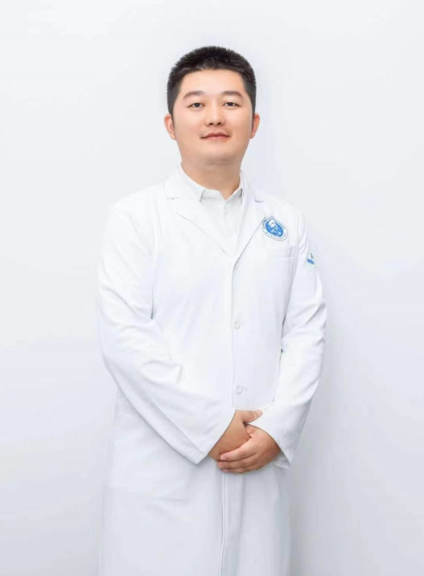

## The Guan Team

**2024.7.24**

---

Welcome to Guan Team!

## 生物信息学平台/实验室

### 简介

​        生物信息学平台/实验室由吉林大学第一医院转化医学研究院创建于2022年9月，旨在利用先进的生物信息学技术和方法，加速医学研究的转化应用。该平台致力于整合临床数据与生物大数据，通过深度数据分析和生物信息学工具的开发，支持疾病机理研究、新药开发、精准医疗和个性化治疗策略的制定。

​       平台定位于促进生物医学数据的高效管理和利用，加强跨学科合作，推动医学研究与临床实践的紧密结合，最终为提高患者治疗效果和生活质量做出贡献。通过提供专业的生物信息学服务和培训，培养一批具有高级生物信息学分析能力的研究人才，满足院内生物信息学服务需求，同时为国内外生物医学研究领域输送新鲜血液。

---

### **PI 简介**

**管青天 博士生导师**

​         2021年获得阿卜杜拉国王科技大学（King Abdullah University of Science and Technology）生命科学博士学位，参与并负责King Abdulaziz City for Science and Technology（KACST）子项目一项；先后在Emerging Infectious Diseases, Journal of Travel Medicine, NAR Genomics and Bioinformatics等杂志发表学术论文20余篇。

2022年人才引进吉林大学第一医院转化医学研究院，组建吉林大学第一医院生物信息学实验室。
主要从事病原微生物基因组分析、宏基因组学医疗诊断工作。

---

### 实验室新闻

