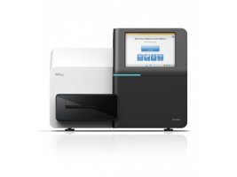

## 更新

**2024.7.24**

1. 新建

---

### **关于本教程**

随着高通量测序技术快速发展，小型台式测序仪的出现降低了高通量测序的门槛。对于开展微生物特别是病原微生物的测序工作的需求，在各种临床，科研以及政府的小型实验室中迅速扩展。目前已经上市的比较适合小型实验室的测序仪如 `Illumina Miseq`，`Illumina NextSeq500`，`Ion S5`，`Ion PGM` 等，即将上市的测序仪如 `Illumina MiniSeq`，`Qiagen GeneReader` 。除了传统的二代测序仪，不需要扩增的基于单分子测序技术的三代测序技术的 `PacBio Sequel` 和最近开展埃博拉实时测序项目的基于纳米孔技术的 `Oxford MinION` 产品都是非常适合开展病原微生物测序的平台。

测序数据的不断产出，需要生物信息学人才来参与到测序数据的分析以便获得有价值的生物学信息对于许多小型实验室来说，很难招募到优秀的生物信息学人才。对于非专业背景的人来说，命令行以及软件的安装可能是学习中遇到的首要难题。本笔记主要是通过介绍微生物，特别是病原细菌的高通量测序数据分析，帮助原来从事湿实验领域的同事能较好的了解和掌握高通量测序数据分析，将学习曲线变得平缓。同时也希望能对从事该领域的其他工作者提供便利，让大家在需要分析微生物基因组数据时，能有一个资料与实例汇集的手册可以快速参考和学习。

本笔记主要针对 Miseq 机器的产出数据开展分析，由于原理类似分析软件也大都可以应用在 Illumina 其他型号的仪器数据上。例子都是运行在安装了 Ubuntu 发行版的 Linux PC 服务器或者 Ubuntu 的个人电脑上。

 

#### Linux 与生物信息

Linux 与生物信息学紧密相关，许多软件运行和数据分析都适合或必须运行在 Linux 操作系统中。关于 Linux 的教学网络上不计其数，这里只对在测序数据分析中可能涉及到的一些基本 Linux 操作做一个简单的介绍。

##### 生信运行环境

生信软件的运行平台环境一般分为以下几种：

1. 基于web：可以在win/mac/linux/bsd等平台运行，只需系统有图形界面，并安装了现代化的主流浏览器如chrome/firefox等。
2. 纯windows环境：常见的商业软件往往只能在win环境下运行，如bionumerics等。
3. 多平台环境：许多生信软件是采用java开发，可以在多个平台下运行。一些C开发的程序也有win/mac/linux版本。
4. 纯linux环境：许多生信软件只能在linux/mac环境下运行，其中大部分又是基于命令行而不需要图形界面。
